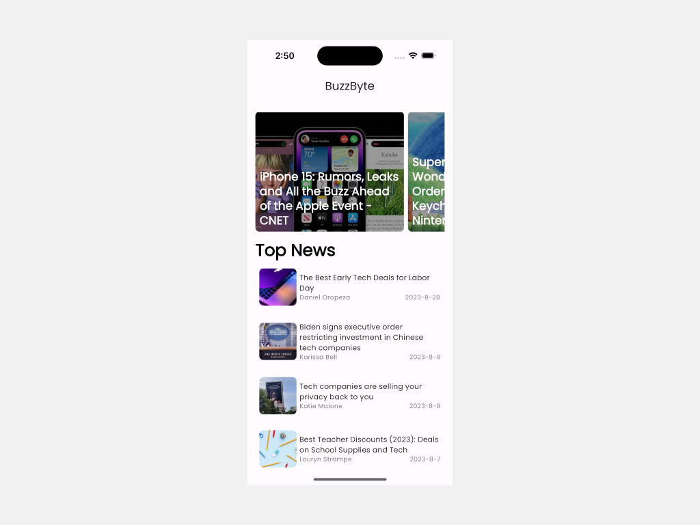

# BuzzByte - Your Tech News Companion

## Overview

**BuzzByte** is a cutting-edge news application tailored specifically for tech enthusiasts. Built using the Flutter framework, it offers a seamless experience on both Android and iOS platforms. The app follows CLEAN architecture practices and leverages the power of BLoC (Business Logic Component) for efficient state management. BuzzByte integrates with the [NewsAPI](https://newsapi.org/) to provide up-to-the-minute tech news. To use the API, users must obtain an API key from [NewsAPI](https://newsapi.org/) and configure it within the app settings.

BuzzByte not only delivers tech news but also offers a visually stunning user interface, robust error handling, and a web view feature that allows users to explore the full articles directly from the app.

## Features

- **Tech News Hub**: Stay informed with the latest tech news from various sources and publications. 📰

- **Cross-Platform**: Flutter ensures a consistent and smooth experience on both Android and iOS devices. 📱

- **CLEAN Architecture**: The app follows CLEAN architecture practices for modular and maintainable code. 🏗️

- **BLoC for State Management**: Utilizes BLoC (Business Logic Component) for efficient state management, ensuring a responsive user interface. 🔄

- **API Integration**: Connects seamlessly with the [NewsAPI](https://newsapi.org/) to fetch and display tech news. 🌐

- **Beautiful UI**: Enjoy a visually appealing and user-friendly interface designed to enhance the reading experience. 🎨

- **Robust Error Handling**: Comprehensive error handling ensures a smooth user experience even in challenging network conditions. 🚧

- **Web View**: Dive deeper into articles by opening them in the integrated web view directly from the app. 🌐

## Screenshots

## Getting Started

1. Clone this repository to your local machine.

2. Open the Flutter project in your preferred development environment.

3. Configure the API key from [NewsAPI](https://newsapi.org/) in the app settings.

4. Build and run the app on your Android or iOS device or simulator.

## Usage

1. Launch the BuzzByte app.

2. Explore the latest tech news from various sources.

3. Click on an article to read more details.

4. Use the integrated web view to access the full article directly from the app.

## API Key Configuration

To access news data, you must obtain an API key from [NewsAPI](https://newsapi.org/). Follow these steps:

1. Visit [NewsAPI](https://newsapi.org/).

2. Sign up or log in to your account.

3. Generate an API key.

4. Open the BuzzByte app and navigate to the settings section.

5. Enter your API key to start fetching tech news.

## License

This project is licensed under the MIT License. See the [LICENSE](LICENSE) file for details.

## Contact

If you have any questions, suggestions, or feedback, please don't hesitate to reach out:

- Email: ✉️ [saeedsaleem.04@gmail.com](mailto:saeedsaleem.04@gmail.com)
- Linkedin: 💼 [Muhammad Saeed](https://www.linkedin.com/in/muhammad-saeed-569527204)
- Twitter: 🐦 [@itssaeed592](https://twitter.com/itssaeed592)
- GitHub: 👨‍💻 [muhammadsaeed05](https://github.com/muhammadsaeed05)

Thank you for using BuzzByte - your reliable source for tech news.
